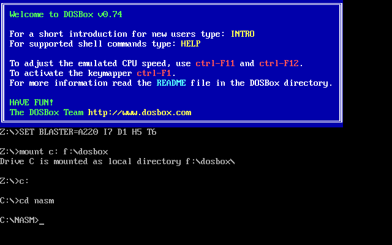

# Task switcher for dos

Simple example program that demonstrates how task switching can be implemented for real mode dos (via interrupt 09h hooking).

Written in 16 bit x86 nasm assembly.

Should work on 286+, but does not conserve FS or GS register currently (keep in mind on 386+).

SWTASK.CFG needs to be updated with the correct command.com path.
